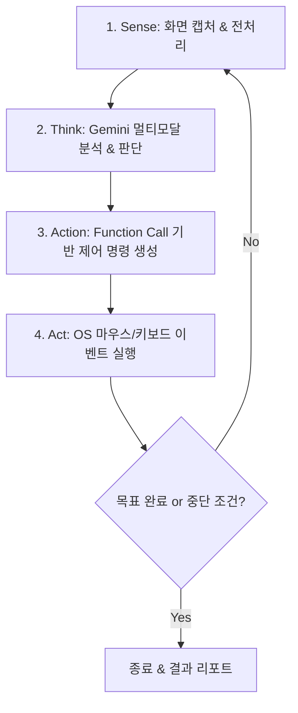

# Gemini 기반 Computer Use 에이전트 기획 및 구현 가이드

본 문서는 **Google Gemini 멀티모달 모델**과 **Python / OpenCV 기반 비전 및 OS 제어 기술**을 결합하여 화면을 인식하고 마우스·키보드를 조작하는 **Computer Use GUI Agent**의 기획 및 시스템 설계서입니다.

---

## 1. 동작 기본 원리 (Sense-Think-Act Loop)

GUI 에이전트는 사람이 화면을 보고 판단하고 조작하는 사이클과 동일하게 루프(Loop) 구조로 동작합니다.



---

## 2. 핵심 기능 요구사항 정의

### (1) 화면 관측 및 시각 전처리 (Sense)
* **초고속 스크린 캡처**:
  * `mss` 또는 OS 네이티브 API(macOS Quartz / ScreenCaptureKit)를 사용하여 100ms 이내 풀스크린 캡처.
* **디스플레이 배율(HiDPI / Retina) 좌표 정규화**:
  * 모델이 인식하는 이미지 해상도와 실제 디스플레이 물리 픽셀 간의 스케일 팩터(Scale Factor) 자동 보정.
  * 좌표계를 0~1000 상대좌표(Normalized Coordinates)로 변환하여 모델에 전달 (해상도 변화에 강건).
* **OpenCV 기반 비전 파이프라인 (하이브리드 전략)**:
  * **Set-of-Mark (SoM) / 좌표 그리드 오버레이**: 캡처된 화면 위에 반투명 그리드나 주요 UI 바운딩 박스를 그려서 모델에 주면 좌표 클릭 정확도가 30~50% 이상 향상.
  * **OpenCV 템플릿 매칭(Template Matching)**: 자주 쓰이는 아이콘(닫기, 최소화, 검색 버튼 등)의 픽셀 단위 정밀 클릭 보정.
  * **차분 감지(Frame Diff / SSIM)**: 액션 직전과 직후 화면을 비교하여 UI가 실제로 바뀌었는지(팝업 뜸, 페이지 전환, 로딩 등) 검증.

### (2) 의사결정 및 추론 엔진 (Think)
* **Gemini 2.5 / 2.0 Flash or Pro 모델 연동**:
  * `google-genai` 최신 SDK 사용.
  * 시스템 프롬프트: 에이전트의 역할, 조작 규칙, 실패 시 복구 전략 정의.
* **Structured Outputs / Function Calling (도구 호출)**:
  * 텍스트 자유 생성이 아닌 구조화된 도구(Tool Call) 형태로만 액션을 출력하도록 강제.
* **컨텍스트 및 히스토리 관리**:
  * 이전 스텝의 (캡처 화면 요약 + 실행한 액션 + 결과 피드백)을 문맥으로 유지하여 무한 루프 방지.
  * 토큰 절약을 위해 이전 이미지들은 버리거나 텍스트 액션 로그 위주로 슬라이딩 윈도우 유지.

### (3) OS 제어 및 조작 실행기 (Act)
* **마우스 제어**:
  * `mouse_move(x, y)`: 자연스러운 커서 이동 (선택적 가감속 베지어 곡선 이동 지원 가능).
  * `mouse_click(x, y, button="left"|"right"|"double")`.
  * `mouse_drag(start_x, start_y, end_x, end_y)`: 드래그 앤 드롭 및 텍스트 블록 지정.
  * `mouse_scroll(direction="up"|"down", amount=3)`.
* **키보드 제어**:
  * `type_text(text)`: 클립보드 복사-붙여넣기(`pyperclip`) 방식과 일반 타이핑 지원 (한글 입력 깨짐 방지를 위해 클립보드 활용 권장).
  * `key_press(key)`: Enter, Tab, Esc, Backspace 등 특수키.
  * `hotkey(keys)`: `["cmd", "c"]`, `["ctrl", "alt", "del"]` 등 단축키 조합.
* **대기 및 동기화**:
  * `wait(seconds)`: 페이지 로딩, 애니메이션 완료 대기.

### (4) 안전장치 및 인터럽트 제어 (Safety & Human-in-the-Loop)
* **비상 정지 (Fail-Safe)**:
  * 마우스를 화면 4개 모서리 중 하나로 이동시키면 즉시 강제 종료 (`pyautogui.FAILSAFE = True`).
  * 글로벌 단축키(예: `Ctrl + C` 또는 `Esc` 길게 누르기) 리스너로 즉시 정지.
* **최대 스텝 수 제한 (Max Iterations)**:
  * 예: 기본 15~20스텝 초과 시 무한 루프 방지를 위해 자동 일시정지 후 사람에게 확인 요청.
* **민감 영역 / 금지 프로세스 가드레일**:
  * 결제 창, 시스템 설정, 비밀번호 입력 필드 감지 시 사람에게 승인 요청.
* **액션 시각화**:
  * 에이전트가 클릭하려는 위치에 빨간 점이나 잔상을 화면에 0.2초간 띄워 사용자가 모니터링 가능하도록 구현.

---

## 3. Gemini Function Calling 스키마 설계

Gemini에 전달할 도구 정의 예시:

```python
computer_tools = [
    {
        "name": "click_coordinate",
        "description": "지정한 화면 좌표(0~1000 정규화 좌표)를 마우스로 클릭합니다.",
        "parameters": {
            "type": "OBJECT",
            "properties": {
                "x": {"type": "NUMBER", "description": "화면 가로 비율 (0: 왼쪽 끝, 1000: 오른쪽 끝)"},
                "y": {"type": "NUMBER", "description": "화면 세로 비율 (0: 상단 끝, 1000: 하단 끝)"},
                "click_type": {
                    "type": "STRING",
                    "enum": ["single", "double", "right"],
                    "description": "클릭 형태 (기본: single)"
                }
            },
            "required": ["x", "y"]
        }
    },
    {
        "name": "type_text",
        "description": "텍스트를 입력합니다. 한글이나 긴 문장은 클립보드를 통해 붙여넣기됩니다.",
        "parameters": {
            "type": "OBJECT",
            "properties": {
                "text": {"type": "STRING", "description": "입력할 텍스트"}
            },
            "required": ["text"]
        }
    },
    {
        "name": "press_hotkey",
        "description": "단축키 조합을 누릅니다 (예: ['command', 'space'], ['ctrl', 'c']).",
        "parameters": {
            "type": "OBJECT",
            "properties": {
                "keys": {
                    "type": "ARRAY",
                    "items": {"type": "STRING"},
                    "description": "눌러야 할 키 배열"
                }
            },
            "required": ["keys"]
        }
    },
    {
        "name": "scroll_page",
        "description": "화면을 위 또는 아래로 스크롤합니다.",
        "parameters": {
            "type": "OBJECT",
            "properties": {
                "direction": {"type": "STRING", "enum": ["up", "down"]},
                "amount": {"type": "INTEGER", "description": "스크롤 양 (기본 3~5)"}
            },
            "required": ["direction"]
        }
    },
    {
        "name": "wait_seconds",
        "description": "화면이 로딩되거나 변경될 때까지 지정된 시간(초) 동안 대기합니다.",
        "parameters": {
            "type": "OBJECT",
            "properties": {
                "seconds": {"type": "NUMBER", "description": "대기할 시간 (초 단위, 기본 1~2초)"}
            },
            "required": ["seconds"]
        }
    },
    {
        "name": "task_finish",
        "description": "목표한 작업을 완료했거나 더 이상 진행할 수 없을 때 호출합니다.",
        "parameters": {
            "type": "OBJECT",
            "properties": {
                "status": {"type": "STRING", "enum": ["SUCCESS", "FAILED"]},
                "result_message": {"type": "STRING", "description": "결과 설명"}
            },
            "required": ["status", "result_message"]
        }
    }
]
```

---

## 4. 권장 기술 스택

| 영역 | 기술/라이브러리 | 선정 이유 |
|---|---|---|
| **AI LLM API** | `google-genai` (Gemini 2.5 / 2.0 Flash) | 빠른 추론 속도, 멀티모달 이미지 처리, 강력한 Function Calling |
| **화면 캡처** | `mss` 또는 macOS `Quartz` / `Pillow` | 초경량, 멀티 모니터 지원, 크로스 플랫폼 고속 캡처 |
| **비전 처리 & 보조** | `OpenCV (cv2)`, `numpy` | 해상도 리사이즈, 좌표 그리드 오버레이, 템플릿 매칭, 차분 검출 |
| **OS 제어** | `pyautogui`, `pynput`, `pyperclip` | 마우스/키보드 에뮬레이션, 한글 클립보드 우회 입력 |
| **환경/설정 관리** | `python-dotenv`, `pydantic` | API 키 보안 및 스키마 검증 |

---

## 5. 단계별 개발 로드맵 (Roadmap)

### Step 1: 화면 캡처 및 좌표계 변환 모듈 (MVP 관측)
- 화면 캡처 후 `1920x1080` 혹은 `1280x720`으로 비율 유지 리사이즈.
- 0~1000 상대 좌표계 $\leftrightarrow$ 실제 화면 물리 픽셀 좌표 매핑 수식 검증.
- 마우스 커서 위치에 붉은 점을 찍어보는 테스트 스크립트 작성.

### Step 2: 액션 실행기 모듈 (MVP 제어)
- `pyautogui`를 래핑한 액터 클래스 구현: 클릭, 타이핑(한글 클립보드 호환), 단축키, 스크롤.
- 비상 탈출 장치(Fail-Safe) 설정.

### Step 3: Gemini 멀티모달 도구 연동 (Agent 루프)
- 프롬프트 설계: *"현재 화면을 보고 사용자의 목표인 '[TASK]'를 수행하기 위해 필요한 단 하나의 액션 함수를 호출하라."*
- 1스텝 실행 $\rightarrow$ 스크린샷 $\rightarrow$ 도구 실행 $\rightarrow$ 반복 루프 완성.

### Step 4: OpenCV 기반 비전 보정 고도화
- **Grid Overlay**: 이미지에 100단위 눈금선을 반투명하게 입혀 Gemini가 좌표를 오차 없이 추론하도록 보조.
- 액션 수행 전후 화면의 차이(SSIM / Diff)를 확인하여 "클릭이 실제로 먹혔는지" 피드백 루프 추가.

### Step 5: UI & CLI 대시보드
- 현재 수행 중인 스텝, 모델의 생각(Thought), 실행된 액션 로그 실시간 출력.
